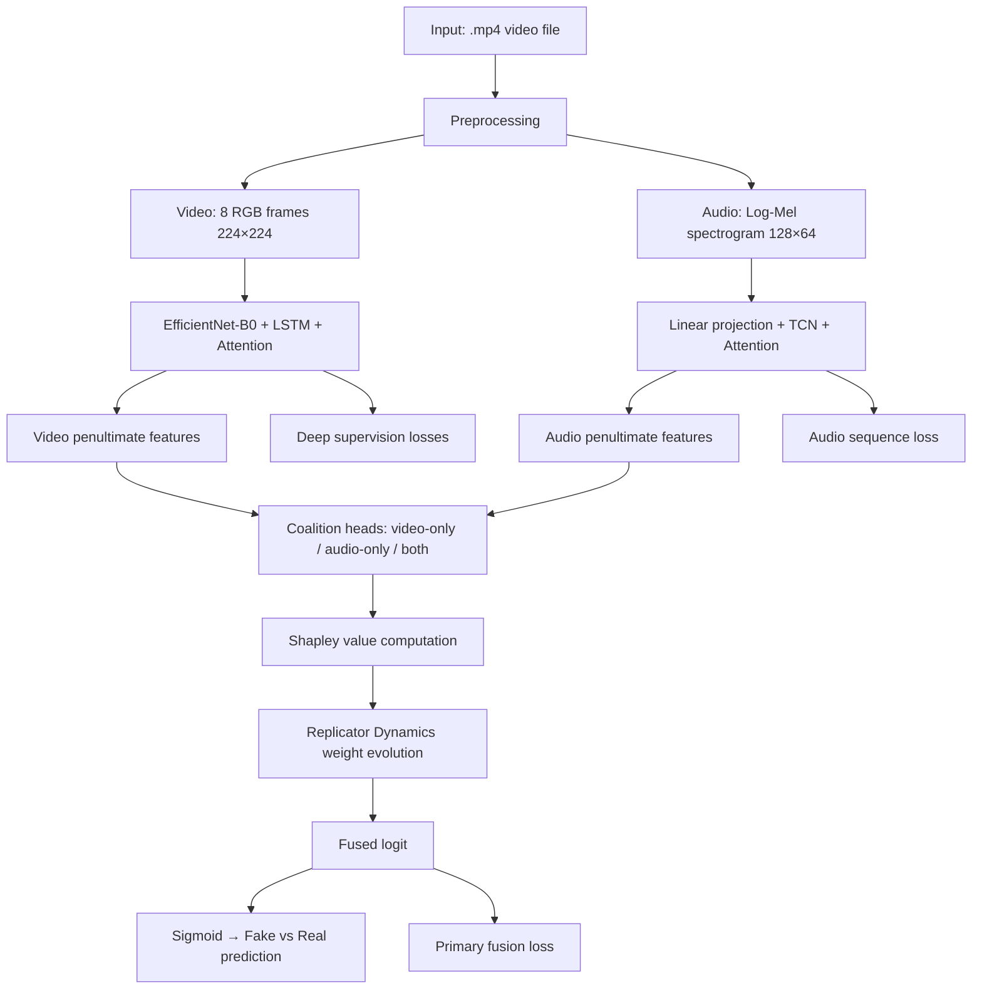

# Replicator–Shapley Fusion: Game-Theoretic Multimodal Deepfake Detection

A PyTorch implementation of multimodal deepfake detection that fuses **video** and **audio** modalities using **Shapley value attribution** and **Replicator Dynamics** for adaptive coalition weighting. The entire pipeline is implemented in a single Jupyter notebook (`replicator_shapley.ipynb`) and was designed to run on the **PolyGlotFake** multilingual deepfake dataset.

[](https://www.python.org/)
[](https://pytorch.org/)
[]()
[]()
[]()
[]()

---

## Table of Contents

- [Motivation](#motivation)
- [Key Features](#key-features)
- [Method Overview](#method-overview)
- [Repository Structure](#repository-structure)
- [Installation](#installation)
- [Dataset](#dataset)
- [Methodology](#methodology)
- [Mathematical Background](#mathematical-background)
- [Architecture Diagram](#architecture-diagram)
- [Training](#training)
- [Evaluation](#evaluation)
- [Notebook Walkthrough](#notebook-walkthrough)
- [Results](#results)
- [Usage](#usage)
- [Customization](#customization)
- [Future Work](#future-work)
- [Citation](#citation)
- [License](#license)
- [Acknowledgements](#acknowledgements)

---

## Motivation

Deepfakes increasingly combine manipulated **visual** and **acoustic** cues, making unimodal detectors brittle when one modality is weak or misleading. Multimodal fusion can improve robustness, but naive concatenation or fixed-weight averaging treats all modalities equally regardless of their per-sample reliability.

This project addresses that limitation with a **game-theoretic fusion layer** that:

1. Treats video-only, audio-only, and joint (video+audio) predictions as **coalitions** in a cooperative game.
2. Computes **Shapley-style marginal contributions** for each coalition.
3. Runs **Replicator Dynamics** to evolve per-sample fusion weights toward an equilibrium over those coalitions.

The result is a sample-adaptive fusion strategy grounded in cooperative game theory, integrated into an end-to-end multimodal deepfake detector trained on PolyGlotFake.

---

## Key Features

- **Video branch:** EfficientNet-B0 backbone with bidirectional LSTM temporal modeling, temporal attention, and deep supervision (frame-level, sequence-level, and main logits).
- **Audio branch:** Log-Mel spectrogram extraction (librosa, with ffmpeg fallback for video files) processed by a Temporal Convolutional Network (TCN) with temporal attention.
- **Game-theoretic fusion:** Closed-form Shapley approximations for two modalities plus a joint coalition, followed by Replicator Dynamics weight updates.
- **Multimodal Competition Regularizer (MCR):** Encourages balanced cooperation between video and audio fusion weights.
- **Fallback MLP fusion:** A standard concatenation-based MLP head is defined alongside the game-theoretic path (available in model outputs; not used in the primary training loss).
- **Imbalanced learning:** Focal Loss, class-weighted `WeightedRandomSampler`, and mixed-precision training (`autocast` + `GradScaler`).
- **Evaluation utilities:** Accuracy, precision, recall, ROC-AUC, per-epoch confusion matrices, and training metric plots.

---

## Method Overview



**High-level pipeline:**

| Stage | Description |
|-------|-------------|
| **Input** | Multilingual `.mp4` videos from PolyGlotFake |
| **Preprocessing** | Uniform frame sampling; audio extracted from the same video via ffmpeg/librosa |
| **Video features** | EfficientNet-B0 → LSTM → temporal attention → penultimate embedding |
| **Audio features** | Log-Mel → linear projection → TCN → temporal attention → penultimate embedding |
| **Fusion** | Three coalition logits via small MLP heads on penultimate features |
| **Replicator Dynamics** | Iteratively update coalition weights using exponentiated utilities |
| **Shapley values** | Closed-form two-player Shapley approximations drive coalition utilities |
| **Classification** | Weighted sum of coalition logits → sigmoid → binary prediction (fake=0, real=1) |

---

## Repository Structure

```
Replicator-Shapley-Fusion-Game-Theoretic-Multimodal-Deepfake-Detection/
├── replicator_shapley.ipynb    # Complete training & evaluation pipeline (self-contained)
├── README.md                   # Project documentation
├── CONTRIBUTING.md             # Contribution guidelines
├── CODE_OF_CONDUCT.md          # Contributor Covenant
├── SECURITY.md                 # Security policy
├── CHANGELOG.md                # Version history
├── requirements.txt            # Python dependencies
├── environment.yml             # Conda environment (optional)
├── .gitignore                  # Git ignore rules
└── .github/
    ├── PULL_REQUEST_TEMPLATE.md
    ├── ISSUE_TEMPLATE/
    │   ├── bug_report.md
    │   └── feature_request.md
    └── workflows/
        └── lint.yml            # Suggested CI workflow (documentation / lint)
```

### File descriptions

| File | Purpose |
|------|---------|
| `replicator_shapley.ipynb` | Monolithic notebook containing all model definitions, data loading, training, evaluation, and plotting. No external Python modules are imported from this repository. |
| `requirements.txt` | Pip-installable dependencies derived from notebook imports. |
| `environment.yml` | Optional Conda environment specification. |

> **Note:** The current repository contains a single notebook. All classes (`VideoBranch`, `AudioBranch`, `GameTheoreticFusion`, `MultiModalDetector`, etc.) are defined inline within `replicator_shapley.ipynb`.

---

## Installation

### Clone the repository

```bash
git clone https://github.com/Debjit-Dhar/Replicator-Shapley-Fusion-Game-Theoretic-Multimodal-Deepfake-Detection.git
cd Replicator-Shapley-Fusion-Game-Theoretic-Multimodal-Deepfake-Detection
```

### Virtual environment (recommended)

```bash
python3 -m venv .venv
source .venv/bin/activate   # Linux / macOS
# .venv\Scripts\activate    # Windows
pip install -r requirements.txt
```

### System dependencies

- **ffmpeg** — required for audio extraction from video files when librosa cannot read the container directly.
- **CUDA-capable GPU** — recommended; the notebook defaults to `cuda` when available.

### Conda (optional)

```bash
conda env create -f environment.yml
conda activate replicator-shapley
```

---

## Dataset

This project is configured for the **[PolyGlotFake](https://www.kaggle.com/datasets)** multilingual deepfake dataset. The notebook expects the following directory layout under `data_root`:

```
PolyGlotFake/
├── real/
│   ├── ar/
│   ├── en/
│   ├── es/
│   ├── fr/
│   ├── ja/
│   ├── ru/
│   └── zh/
└── fake/
    ├── to_ar/
    ├── to_en/
    ├── to_es/
    ├── to_fr/
    ├── to_ja/
    ├── to_ru/
    └── to_zh/
```

Each subdirectory contains `.mp4` video files. The `collect_videos()` function assigns:

| Label | Value | Directories |
|-------|-------|-------------|
| Fake | `0` | `fake/to_*` |
| Real | `1` | `real/*` |

Audio is extracted from the **same `.mp4` file** as the video (no separate audio files are required). The default Kaggle path in the notebook is:

```
/kaggle/input/polyglotfake-rs/PolyGlotFake
```

> **Download:** Obtain PolyGlotFake from Kaggle or the dataset authors. No download link is bundled in this repository.

### Train / validation split

- **80% train / 20% validation** via `sklearn.model_selection.train_test_split`
- `stratify=labels`, `random_state=42`

---

## Methodology

### Image (Video) Pipeline

1. **Frame extraction** (`extract_frames`): Uniformly sample `num_frames=8` frames from each video using OpenCV; resize to `224×224` RGB.
2. **Augmentation (train):** Random horizontal flip, color jitter, ImageNet normalization.
3. **Backbone:** `torchvision.models.efficientnet_b0(weights='DEFAULT')` — feature dimension **1280**.
4. **Freezing:** First `layers_to_freeze=2` EfficientNet feature blocks have gradients disabled.
5. **Temporal modeling:** 2-layer bidirectional LSTM (`lstm_hidden_dim=128` → output dim **256**).
6. **Temporal attention:** Softmax-weighted pooling over LSTM outputs.
7. **Outputs:**
   - `main_logits` — primary video classifier
   - `seq_logits` — sequence-level auxiliary head
   - `frame_logits` — per-frame auxiliary head `(B, T)`
   - `penultimate` — ReLU-activated embedding fed to fusion `(B, 128)`

### Audio Pipeline

1. **Spectrogram extraction** (`LogMelSpectrogramProcessor`):
   - Sample rate: 16 kHz, mono
   - `n_mels=64`, `n_fft=1024`, `hop_length=256`, Hamming window
   - Fixed temporal length: `audio_num_frames=128`
   - Output shape: `(128, 64)` — time × mel bins
2. **ffmpeg fallback:** For video containers (`.mp4`, `.mkv`, `.mov`, `.avi`, `.webm`), audio is extracted to a temporary WAV file before librosa loading.
3. **Neural processing:**
   - Linear projection: `64 → tcn_hidden_dim (256)`
   - TCN with channels `[256]`, kernel size 3, WaveNet-style activations
   - Temporal attention pooling
4. **Outputs:**
   - `seq_logits` — audio sequence classifier
   - `penultimate` — ReLU-activated embedding `(B, 256)` fed to fusion

### Feature Extraction Summary

| Modality | Input | Backbone / Processor | Penultimate dim |
|----------|-------|----------------------|-----------------|
| Video | 8 × 3 × 224 × 224 | EfficientNet-B0 + Bi-LSTM | 128 |
| Audio | 128 × 64 Log-Mel | Linear + TCN | 256 |

### Fusion

The `GameTheoreticFusion` module operates on penultimate features from both branches:

1. **Coalition heads** produce three scalar logits per sample:
   - \( \ell_v = \text{head}_v(\mathbf{h}_v) \) — video-only
   - \( \ell_a = \text{head}_a(\mathbf{h}_a) \) — audio-only
   - \( \ell_{both} = \text{head}_{both}([\mathbf{h}_v; \mathbf{h}_a]) \) — joint coalition

2. **Shapley approximations** (closed form for two players):

\[
\phi_v = \tfrac{1}{2}(\ell_v + \ell_{both} - \ell_a)
\]
\[
\phi_a = \tfrac{1}{2}(\ell_a + \ell_{both} - \ell_v)
\]
\[
\phi_{both} = \mathrm{ReLU}\!\left(\ell_{both} - \tfrac{1}{2}(\ell_v + \ell_a)\right)
\]

3. **Non-negative utilities:** \( u_i = \mathrm{ReLU}(\phi_i) \) for \( i \in \{v, a, both\} \).

4. **Replicator Dynamics** (see below) produce weights \( w_v, w_a, w_b \).

5. **Fused logit:**

\[
\ell_{fused} = w_v \ell_v + w_a \ell_a + w_b \ell_{both}
\]

6. **MCR regularizer:**

\[
\mathcal{L}_{MCR} = \lambda_{mcr} \cdot \mathbb{E}\left[|w_v - w_a|\right], \quad \lambda_{mcr} = 0.5
\]

A **fallback MLP** (`fallback_fusion`) concatenates penultimate features and produces an alternative logit, but the training loss uses `fusion_logit` from the game-theoretic path.

### Replicator Dynamics

Weights \( \mathbf{W} = [w_v, w_a, w_b] \) are initialized uniformly: \( w_i = 1/3 \).

For `replicator_steps=6` iterations:

\[
\eta = \frac{0.5}{\tau}, \quad \tau = \text{temperature} = 1.0
\]
\[
\mathbf{W} \leftarrow \mathbf{W} \odot \exp(\eta \mathbf{U})
\]
\[
\mathbf{W} \leftarrow \frac{\mathbf{W}}{\sum_i W_i + \epsilon}
\]

where \( \mathbf{U} = [u_v, u_a, u_{both}] \) and \( \odot \) denotes element-wise multiplication. This is a discrete-time multiplicative update (replicator equation) that reallocates weight toward coalitions with higher utility.

### Shapley Value Computation

For a two-player cooperative game with characteristic function \( v(\cdot) \) evaluated via coalition logits, the implementation uses the standard closed-form Shapley values for players "video" and "audio," plus a derived utility for the joint coalition. The coalition logits act as stand-ins for the value function \( v(S) \) for singleton and grand-coalition sets.

### Final Decision Layer

\[
\hat{y} = \mathbb{1}\!\left[\sigma(\ell_{fused}) \geq 0.5\right]
\]

where \( \sigma \) is the sigmoid function. Labels: **fake = 0**, **real = 1**.

---

## Mathematical Background

### Replicator Dynamics

Replicator Dynamics model evolutionary selection among strategies (here, fusion coalitions). Strategies with above-average fitness (utility) grow in proportion; below-average strategies shrink. In this implementation, fitness is the ReLU of Shapley-style marginal contributions, and the dynamics run for a fixed number of steps per forward pass.

### Evolutionary Game Theory

The fusion layer can be viewed as a population of three "strategies" (video-only, audio-only, both) competing for contribution to the final prediction. The equilibrium reached after replicator steps represents an adaptive balance for each input sample.

### Shapley Value

The Shapley value fairly distributes the total payoff among players based on their average marginal contribution across all join orders. For two players, the closed-form expressions used in code correspond to:

\[
\varphi_v = \tfrac{1}{2}\left[v(\{v\}) + v(\{v,a\}) - v(\{a\})\right]
\]

where coalition logits substitute for \( v(S) \).

### Fusion Equilibrium

After `replicator_steps` updates, the normalized weights \( \mathbf{W} \) represent a per-sample equilibrium over coalition strategies, used to form the final fused logit.

### Feature Importance

The fusion weights \( w_v, w_a, w_b \) (returned in `fusion_aux['weights']`) provide per-sample interpretability into how much each coalition contributes to the final decision.

---

## Architecture Diagram

```mermaid
graph TB
    subgraph Input
        V[Video .mp4]
    end

    subgraph VideoBranch["Video Branch"]
        VF[extract_frames → 8×224×224]
        EN[EfficientNet-B0]
        LSTM[Bi-LSTM 2-layer]
        TA1[Temporal Attention]
        VH[Penultimate h_v ∈ R^128]
        VMAIN[Main classifier]
        VSEQ[Seq classifier]
        VFRM[Frame classifier]
    end

    subgraph AudioBranch["Audio Branch"]
        AP[Log-Mel 128×64]
        PL[Linear 64→256]
        TCN[TCN]
        TA2[Temporal Attention]
        AH[Penultimate h_a ∈ R^256]
        ASEQ[Seq classifier]
    end

    subgraph GameTheoreticFusion["Game-Theoretic Fusion"]
        HV[head_v → ℓ_v]
        HA[head_a → ℓ_a]
        HB[head_both → ℓ_both]
        SH[Shapley φ_v, φ_a, φ_both]
        RD[Replicator Dynamics ×6]
        FUSE[ℓ_fused = Σ w_i ℓ_i]
        MCR[MCR: |w_v − w_a|]
    end

    subgraph Fallback["Fallback (not in primary loss)"]
        MLP[Concat MLP]
    end

    V --> VF --> EN --> LSTM --> TA1 --> VH
    VH --> VMAIN & VSEQ & VFRM
    V --> AP --> PL --> TCN --> TA2 --> AH --> ASEQ

    VH --> HV & HB
    AH --> HA & HB
    HV & HA & HB --> SH --> RD --> FUSE
    RD --> MCR
    VH & AH --> MLP

    FUSE --> OUT[Sigmoid → Prediction]
```

---

## Training

All training hyperparameters are defined in the `CONFIG` dictionary inside `replicator_shapley.ipynb`.

| Parameter | Default (`CONFIG`) | `main()` override |
|-----------|-------------------|-------------------|
| Optimizer | AdamW | — |
| Learning rate | `2e-4` | — |
| Weight decay | `1e-4` | — |
| Scheduler | `ReduceLROnPlateau` (factor=0.5, patience=3) | — |
| Loss | Focal Loss (α=0.25, γ=2.0) | — |
| Epochs | `20` | **`3`** |
| Batch size | `8` | `8` |
| Mixed precision | Yes (`autocast` + `GradScaler`) | — |
| Sampler | `WeightedRandomSampler` (class-balanced) | — |

### Total loss

\[
\mathcal{L} = \mathcal{L}_{fused} + 0.5\,\mathcal{L}_{video} + 0.5\,\mathcal{L}_{seq} + 0.5\,\mathcal{L}_{frame} + \mathcal{L}_{MCR}
\]

- \( \mathcal{L}_{fused} \) — Focal Loss on `fusion_logit`
- \( \mathcal{L}_{video} \) — Focal Loss on `video_logit`
- \( \mathcal{L}_{seq} \) — Focal Loss on `video_seq_logit`
- \( \mathcal{L}_{frame} \) — Focal Loss on flattened `frame_logits`
- \( \mathcal{L}_{MCR} \) — multimodal competition regularizer from fusion aux

### Checkpointing

| File | Saved when |
|------|------------|
| `checkpoints_multimodal/best_multimodal.pth` | Best validation accuracy (includes model, optimizer, epoch, config) |
| `checkpoints_multimodal/final_multimodal.pth` | End of training (model state dict only) |
| `checkpoints_multimodal/confusion_matrix_epoch_*.png` | Each validation epoch |
| `checkpoints_multimodal/training_metrics.png` | End of training |

> **Note:** `early_stopping_patience=6` is defined in `CONFIG` but is **not implemented** in the `train_multimodal()` loop.

---

## Evaluation

Metrics computed each validation epoch on `fusion_logit`:

| Metric | Implementation |
|--------|----------------|
| **Accuracy** | Fraction of correct predictions at threshold 0.5 |
| **Precision** | `sklearn.metrics.precision_score` |
| **Recall** | `sklearn.metrics.recall_score` |
| **AUC** | `sklearn.metrics.roc_auc_score` on sigmoid probabilities |
| **Confusion Matrix** | `sklearn.metrics.confusion_matrix`, plotted with seaborn |

**Not implemented in code:** F1 score, ROC curve plots (only AUC scalar is computed).

Confusion matrix labels:

| | Predicted Fake | Predicted Real |
|--|----------------|----------------|
| **True Fake** | TN | FP |
| **True Real** | FN | TP |

---

## Notebook Walkthrough

`replicator_shapley.ipynb` contains three cells:

### Cell 1 — Dependencies

```python
!pip install timm opencv-python torch torchvision
```

Installs core packages. Additional imports (`librosa`, `scikit-learn`, `matplotlib`, `seaborn`, `tqdm`) are expected to be available in the runtime environment (e.g., Kaggle).

### Cell 2 — Title

Markdown heading: `# PolyGotFake Training`

### Cell 3 — Full pipeline

The main code cell is structured as follows:

| Section | Functions / Classes |
|---------|---------------------|
| **Configuration** | `CONFIG` dict with all hyperparameters |
| **Utilities** | `plot_confusion_matrix`, `plot_metrics`, `FocalLoss` |
| **Preprocessing** | `extract_frames`, `LogMelSpectrogramProcessor` |
| **Temporal modules** | `TCN`, `TCNBlock`, `CausalConv1d`, `TemporalAttention` |
| **Video branch** | `VideoBranch` |
| **Audio branch** | `AudioBranch` |
| **Fusion** | `GameTheoreticFusion`, `MultiModalDetector` |
| **Dataset** | `MultiModalDataset`, `collect_videos` |
| **Training** | `get_class_weights`, `train_multimodal` |
| **Entry point** | `main()` |

**Execution flow in `main()`:**

1. Set `data_root` to PolyGlotFake path; override `num_epochs=3`.
2. Collect all `.mp4` paths and labels via `collect_videos()`.
3. Stratified 80/20 train/validation split.
4. Build train/val datasets with transforms.
5. Create `WeightedRandomSampler` for class balance.
6. Instantiate `MultiModalDetector`.
7. Call `train_multimodal()` → saves checkpoints and plots.
8. Save `final_multimodal.pth`.

---

## Results

The notebook metadata indicates a prior Kaggle execution (papermill duration ≈ 10.6 hours on an NVIDIA Tesla T4 GPU), but **no output cells or metric values are saved** in the current notebook file (`execution_count: null`, empty `outputs`).

Therefore, **no quantitative results can be reported from this repository**. After training, metrics are printed per epoch to stdout and plots are saved under `./checkpoints_multimodal/`.

---

## Usage

### Run on Kaggle

1. Add the PolyGlotFake dataset to your Kaggle notebook.
2. Upload or fork `replicator_shapley.ipynb`.
3. Ensure the `data_root` path matches your Kaggle dataset mount.
4. Run all cells.

### Run locally

1. Install dependencies (see [Installation](#installation)).
2. Place PolyGlotFake under a local path.
3. Edit `CONFIG['data_root']` and `main()` accordingly:

```python
CONFIG['data_root'] = '/path/to/PolyGlotFake'
CONFIG['num_epochs'] = 20  # use full epoch count for production runs
```

4. Execute the notebook or convert and run as a script:

```bash
jupyter notebook replicator_shapley.ipynb
```

### Inference

The repository does not include a standalone inference script. To run inference, load a saved checkpoint:

```python
model = MultiModalDetector(CONFIG, audio_n_mels=CONFIG['audio_n_mels'])
checkpoint = torch.load('checkpoints_multimodal/best_multimodal.pth', map_location='cpu')
model.load_state_dict(checkpoint['model_state_dict'])
model.eval()
# Pass rgb_tensor (1, T, C, H, W) and mel_tensor (1, seq, n_mels)
```

---

## Customization

| Goal | What to change |
|------|----------------|
| **Different dataset** | Modify `collect_videos()` paths/labels; update `CONFIG['data_root']` |
| **More frames** | `CONFIG['num_frames']` |
| **Different backbone** | Replace EfficientNet in `VideoBranch` |
| **Transformer temporal model** | Set `CONFIG['use_transformer']=True` |
| **Fusion behavior** | Adjust `temperature`, `replicator_steps`, `mcr_weight` in `GameTheoreticFusion` |
| **Replace fusion module** | Swap `self.gt_fusion` in `MultiModalDetector`; update `train_multimodal()` loss to use new output key |
| **Training duration** | `CONFIG['num_epochs']` (default 20; `main()` currently sets 3) |
| **Batch size / LR** | `CONFIG['batch_size']`, `CONFIG['learning_rate']` |

---

## Future Work

Realistic extensions based on the current codebase:

- Extract modules into importable Python packages (`models/`, `data/`, `train.py`).
- Implement the configured but unused early stopping logic.
- Add F1 score and ROC curve visualization.
- Integrate `fallback_logit` into training (e.g., ensemble or ablation loss).
- Standalone inference CLI and ONNX/TorchScript export.
- Cross-dataset evaluation (FaceForensics++, DFDC, etc.).
- Ablation studies: fusion vs. concatenation, Shapley-only vs. Replicator-only.
- Remove unused `timm` import or adopt timm backbones consistently.

---

## Citation

If you use this code in your research, please cite:

```bibtex
@misc{dhar2025replicatorshapley,
  author       = {Dhar, Debjit},
  title        = {Replicator--Shapley Fusion: Game-Theoretic Multimodal Deepfake Detection},
  year         = {2025},
  publisher    = {GitHub},
  howpublished = {\url{https://github.com/Debjit-Dhar/Replicator-Shapley-Fusion-Game-Theoretic-Multimodal-Deepfake-Detection}}
}
```

---

## License

No `LICENSE` file is present in the current repository contents. Please contact the repository owner to clarify terms of use before redistribution or commercial use.

---

## Acknowledgements

- **[PolyGlotFake](https://www.kaggle.com/datasets)** — multilingual deepfake dataset used for training.
- **PyTorch** and **torchvision** — deep learning framework and EfficientNet backbone.
- **librosa** — audio feature extraction.
- **scikit-learn** — train/validation split and metrics.
- Developed for Kaggle notebook execution with GPU acceleration.
